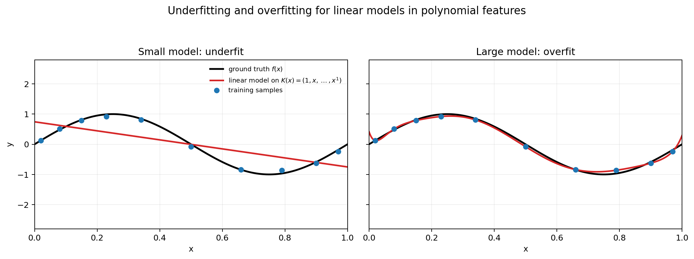
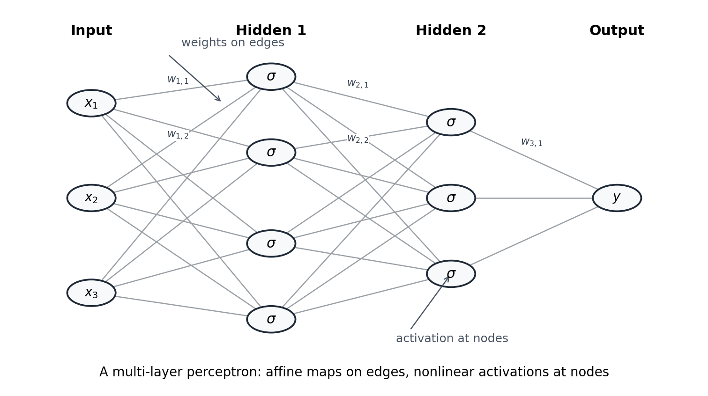
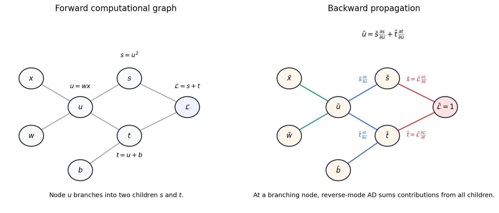
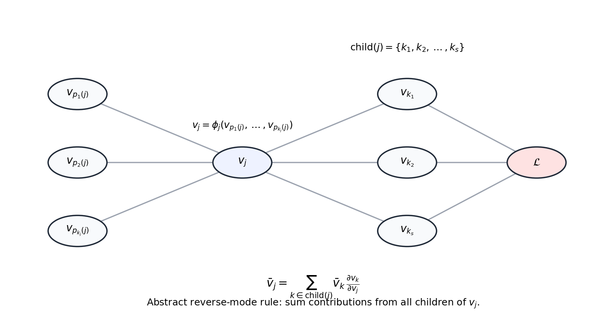
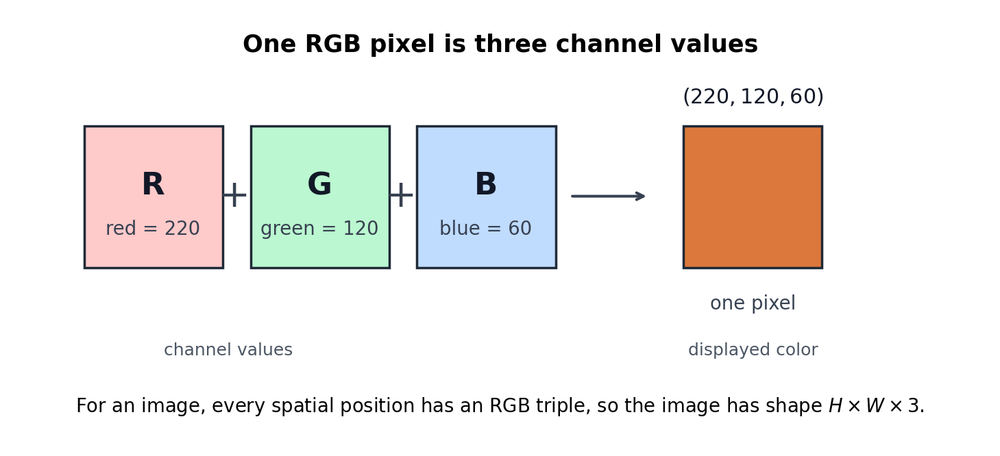
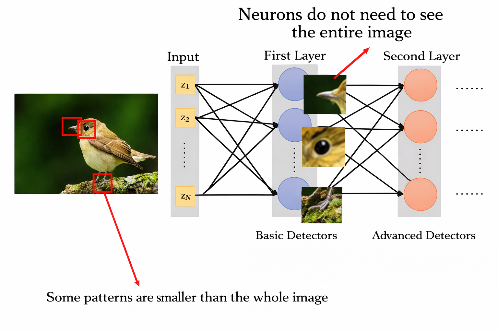
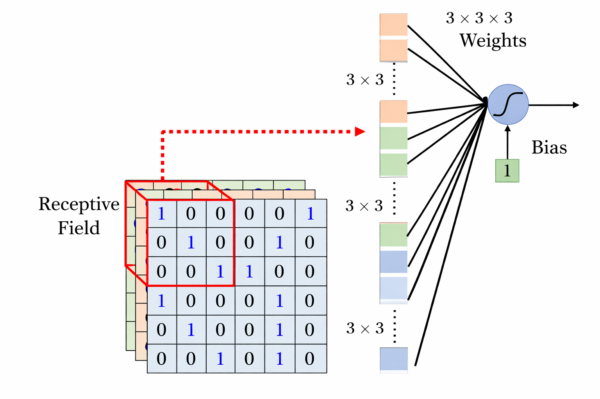
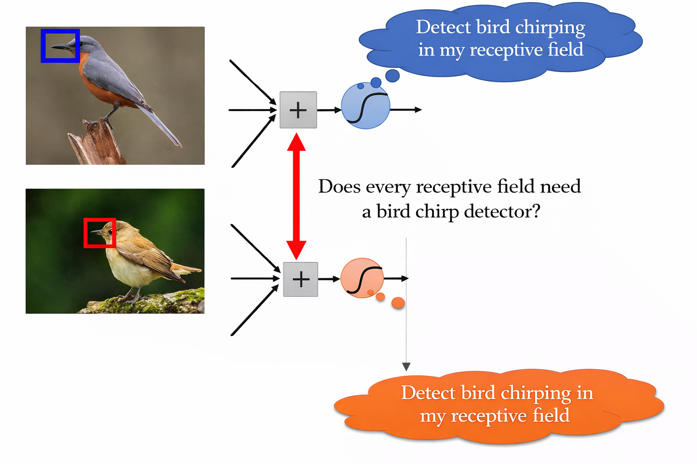
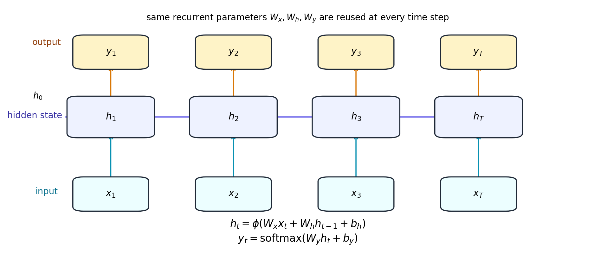
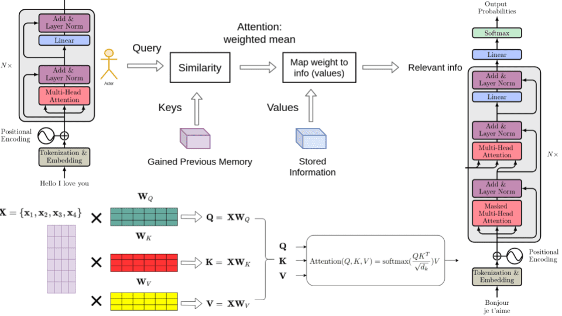

# Machine learning

[1] Chapter 1-2

## Tasks, model, ground truth and loss function

Machine learning tries to recover an unknown rule from data. We observe examples

$$
(x_1, y_1), (x_2, y_2), \dots, (x_N, y_N),
$$

where $x_i$ is the input and $y_i = f(x_i)$ is generated by an unknown **ground-truth** function $f$. The goal is to recover or approximate this unknown function from finitely many examples.

Since the true function $f$ is unknown, we introduce a parameterized **model** $f_\theta(x)$ to approximate it. Here $x$ is the input, $\theta$ denotes the parameters, and $f_\theta(x)$ is the prediction produced by the model.

We can think of the data as being sampled from some underlying distribution. Machine learning does not usually know the true rule $f$; instead, it only sees finite examples and tries to learn a model that captures the relevant pattern.

The type of output determines the task. In **regression**, the target is continuous, such as a price or temperature. In **classification**, the target is a discrete random variable taking values in a finite label set, such as whether an image is a cat or a dog.

For regression, the model outputs a real number:

$$
y = f_\theta(x), \qquad y \in \mathbb{R}.
$$

A standard **loss** for regression is mean squared error:

$$
\mathcal{L}_{\mathrm{reg}}(\theta) = \frac{1}{N} \sum_{i=1}^{N} \left( f_\theta(x_i) - y_i \right)^2.
$$

For classification with label set

$$
\mathcal{Y} = \{y_1, y_2, \dots, y_C\},
$$

the goal is to model the conditional discrete distribution of the label given the input. The model outputs a distribution over the finite set $\mathcal{Y}$:

$$
f_\theta(x) = \bigl( p_\theta(y_1\mid x), \dots, p_\theta(y_C \mid x) \bigr),
$$

A standard **loss** for classification is cross-entropy:

$$
\begin{aligned}
\mathcal{L}_{\mathrm{cls}}(\theta) &= - \frac{1}{N} \sum_{i=1}^{N}
\mathbb{E}_{p(\cdot \mid x_i)} \log p_\theta(\cdot \mid x_i)
\\
&= - \frac{1}{N} \sum_{i=1}^{N}
\sum_{c=1}^C p(y_c \mid x_i) \log p_\theta(y_c \mid x_i).
\end{aligned}
$$

where $p(y \mid x_i) = \delta_{y = y_i}$ equals $1$ if $y$ is the ground truth label and $0$ otherwise.

Different tasks use different loss functions because the structure of the output space is different.

For example, if $x$ is an email and $y$ is whether it is spam, then $f_\theta(x)$ should output a score or probability for the spam class. If $x$ is a house description and $y$ is the price, then $f_\theta(x)$ should output a number.

**Question.** Why is cross-entropy a loss function?

## Optimization

Once we choose a model and a loss, finding the parameter becomes an optimization problem. We adjust the parameters $\theta$ so that the loss on the training data becomes small.

The basic **gradient descent** update is:

$$
\theta_{t+1} = \theta_t - \eta \nabla_\theta \mathcal{L}(\theta_t),
$$

where $\eta$ is the learning rate. This means we move the parameters in the negative gradient direction to reduce the loss.

**Question.** Why does gradient descent optimize the parameter?

## Expressiveness, convergence and generalization

Three ideas appear throughout machine learning.

**Expressiveness** asks whether the model family we choose is broad enough to contain, or at least approximate, the ground-truth function.

**Convergence** asks: assuming there exists a good parameter, is the optimization process numerically stable and convergent enough to actually find it in practice?

**Generalization** asks whether a small loss on the observed samples really means that the model is close to the ground truth on unseen data as well. A model that fits the training samples but fails on new examples is overfitting.

## Linear/convex model and their restriction

**Linear models** are an important starting point because they often lead to convex optimization problems, and convex losses usually have good convergence behavior. More generally, when the loss as a function of the parameters is convex, optimization is numerically more stable and it is easier to find a global optimum. This is one reason linear and other convex models were so popular before neural networks.

A linear model has the form

$$
f_\theta(x) = \theta^\top K(x) + b.
$$

Linear models are not the only convex models. We can build more complicated convex learning problems by keeping the optimization convex in the parameters, for example logistic regression, linear models with regularization, support vector machines, and kernel methods in their convex formulations. These models can be more powerful than plain linear regression, but their expressive power is still controlled by a carefully restricted hypothesis class so that optimization remains tractable.

There is a basic tradeoff between expressiveness and generalization. If the parameter space is too small, the model may be too simple to represent the ground truth. This is called **underfitting**. If the parameter space is too large, the model becomes more expressive and may fit the training samples extremely well, but it may fail on unseen data. This is called **overfitting**.

The following picture shows both effects using a linear model on polynomial features

$$
K(x) = (1, x, \dots, x^P).
$$

When $P$ is too small, the model cannot capture the true pattern and underfits. When $P$ is too large, the model can match the training samples closely but oscillate away from them, which is overfitting.

Deep learning becomes necessary because many important problems require much richer model families, even though this makes optimization and generalization analysis harder.

# General deep learning problem

[1] Chapter 3 + Auto-differentiation

## Multi-layer perceptron

From the viewpoint of expressiveness, linear models are limited because they only apply one affine map to the input. Many realistic functions are more naturally written as a composition of simple steps. For example, recognizing a cat may involve first detecting edges, then parts such as ears or eyes, and then assembling these local features into a final concept. This compositional structure motivates the **multi-layer perceptron (MLP)**.

An MLP alternates affine maps and nonlinear activation functions. For an $L$-layer MLP, we write

$$
\begin{aligned}
&h^{(0)} = x,
\\
&z^{(\ell)} = W^{(\ell)} h^{(\ell-1)} + b^{(\ell)}, \qquad &&\ell = 1, \dots, L,
\\
&h^{(\ell)} = \sigma\bigl(z^{(\ell)}\bigr), \qquad &&\ell = 1, \dots, L-1,
\end{aligned}
$$

and the final output for regression problem is

$$
f_\theta(x) = z^{(L)} \quad \text{or} \quad f_\theta(x) = h^{(L)},
$$

depending on the task. Here $W^{(\ell)}$ are the weights, $b^{(\ell)}$ are the **biases**, and $\sigma$ is an **activation function** such as **ReLU** $(\mathrm{ReLU}(x)=\max(x,0))$, **sigmoid** $(\sigma(x)=\frac{1}{1+e^{-x}})$, or **tanh**.

For classification, the output of the final layer is usually called the **logits**. These logits are then converted into a probability distribution over classes by the softmax function:

$$
p_\theta(y_c \mid x)=\frac{\exp(z_c)}{\sum_{c'=1}^C \exp(z_{c'})}.
$$

In a more compact form, $f_\theta(x)$ can be written as

$$
f_\theta(x) = W^{(L)} \sigma \Bigl(W^{(L-1)}\sigma\bigl(\cdots\sigma\bigl(W^{(1)} x + b^{(1)}\bigr)\cdots\bigr)+ b^{(L-1)}\Bigr)+ b^{(L)}.
$$

The key point is that the composition of many simple nonlinear steps can represent functions that are much more complicated than a single linear layer.

The following picture shows a simple MLP. The **weights** correspond to the edges between layers, and each node applies an activation function to the weighted sum coming from the previous layer.

## Optimization

### Full gradient descent

In both regression and classification, the total loss can be written as a sum of local contributions from individual samples:

$$
\mathcal{L}(\theta) = \frac{1}{N} \sum_{i=1}^N \ell_i(\theta),
$$

where each term $\ell_i(\theta)$ depends only on the $i$-th sample $(x_i, y_i)$. For example, in regression,

$$
\ell_i(\theta) = \left( f_\theta(x_i) - y_i \right)^2,
$$

and in classification,

$$
\ell_i(\theta) = - \mathbb{E}_{p(\cdot \mid x_i)} \log p_\theta(\cdot \mid x_i).
$$

Because the full loss is a sum over all samples, its gradient is also a sum over all samples. **Full gradient descent** uses this exact full-data gradient at every update:

$$
\theta_{t+1} = \theta_t - \eta \nabla_\theta \mathcal{L}(\theta_t).
$$

This gives a stable and accurate descent direction, but every update is expensive because it requires one full pass over the dataset.

### Stochastic gradient descent 

In **stochastic gradient descent (SGD)**, we replace the full gradient by the gradient on a randomly sampled **mini-batch** $B_t$:

$$
\theta_{t+1} = \theta_t - \eta \frac{1}{|B_t|} \sum_{i \in B_t} \nabla_\theta \ell\bigl(f_\theta(x_i), y_i\bigr).
$$

This makes each update much cheaper, which is essential for large datasets. The gradient estimate is noisy, but this noise is often helpful in practice because it can prevent the optimization from getting stuck too easily in bad regions.

### AdaGrad

**AdaGrad** changes the learning rate coordinate-wise according to past gradient magnitudes:

$$
g_t = \nabla_\theta \mathcal{L}(\theta_t), \qquad
G_t = \sum_{s=1}^t g_s \odot g_s,
$$

where $\odot$ denotes element-wise multiplication.

$$
\theta_{t+1} = \theta_t - \eta \frac{g_t}{\sqrt{G_t} + \varepsilon}.
$$

Coordinates that have received many large gradients get smaller future steps, while rarely updated coordinates keep relatively large steps. This can speed up convergence, especially when different coordinates have very different scales.

### Momentum

**Momentum** smooths the update direction by accumulating a running average of past gradients:

$$
v_{t+1} = \beta v_t + \nabla_\theta \mathcal{L}(\theta_t),
$$

$$
\theta_{t+1} = \theta_t - \eta v_{t+1}.
$$

This helps accelerate movement along consistent directions and reduces oscillation across steep directions. In practice, it can also help optimization move through shallow saddle regions more effectively than plain gradient descent.

### Weight regularization

**Weight regularization** modifies the objective so that excessively large parameters are penalized. A standard choice is $\ell_2$ regularization:

$$
\mathcal{L}_{\mathrm{reg}}^{\lambda}(\theta)=\mathcal{L}(\theta) + \lambda \|\theta\|_2^2.
$$

This biases the optimizer toward smaller weights, which often improves generalization. In practice, plain SGD itself also has an implicit regularization effect, and explicit regularization is often used together with it.

### Adam/AdamW

**Adam** combines momentum with coordinate-wise adaptive scaling. With

$$
g_t = \nabla_\theta \mathcal{L}(\theta_t),
$$

it keeps first and second moment estimates

$$
m_{t+1} = \beta_1 m_t + (1-\beta_1) g_t,
$$

$$
v_{t+1} = \beta_2 v_t + (1-\beta_2) (g_t \odot g_t),
$$

and updates parameters using a normalized direction. Adam is usually easier to tune and converges faster early in training than plain SGD.

**AdamW** separates weight decay from the adaptive gradient step, which makes the effect of regularization cleaner. This is the standard optimizer in much of modern deep learning, including large language models.

### Auto-differentiation

Training requires computing gradients of the loss with respect to all parameters. For an MLP, these derivatives are computed by repeated application of the chain rule.

For example, if

$$
z^{(\ell)} = W^{(\ell)} h^{(\ell-1)} + b^{(\ell)}, \qquad
h^{(\ell)} = \sigma\bigl(z^{(\ell)}\bigr),
$$

then the gradient at layer $\ell$ depends only the gradient from layer $\ell + 1$. If we define

$$
\delta^{(\ell)} = \frac{\partial \mathcal{L}}{\partial z^{(\ell)}},
$$

then the MLP backward recursion has the form

$$
\delta^{(\ell)}=\left( W^{(\ell+1)\top} \delta^{(\ell+1)} \right) \odot \sigma'\bigl(z^{(\ell)}\bigr),
$$

and parameter gradients are

$$
\frac{\partial \mathcal{L}}{\partial W^{(\ell)}} = \delta^{(\ell)} {h^{(\ell-1)}}^\top,
\qquad
\frac{\partial \mathcal{L}}{\partial b^{(\ell)}} = \delta^{(\ell)}.
$$

This same idea works for any computational graph, not just for MLPs. A **computational graph** is a directed acyclic graph whose nodes are intermediate variables and whose edges indicate data dependence. The left panel below shows a simple example:

$$
u = wx, \qquad s = u^2, \qquad t = u + b, \qquad \mathcal{L} = s + t.
$$

The important feature is that the variable $u$ is reused twice: once to form $s$ and once to form $t$. This is exactly why backward propagation must accumulate gradient contributions from multiple children.

Now we consider general computation graph as demonstrated by the picture below.

We have intermediate variables associated with each node

$$
v_1, v_2, \dots, v_m,
$$

where each node is computed from earlier nodes:

$$
v_j = \phi_j\bigl(v_{p_1(j)}, \dots, v_{p_{k_j}(j)}\bigr).
$$

Here $p_1(j), \dots, p_{k_j}(j)$ are the parents of node $j$, meaning the inputs needed to compute $v_j$. The final node is the loss

$$
v_m = \mathcal{L}.
$$

The picture above should be read in two directions. In the **forward pass**, information flows from left to right: the parent nodes $v_{p_1(j)}, \dots, v_{p_{k_j}(j)}$ are first computed, then the node $v_j$ is evaluated by applying the local rule $\phi_j$, and finally $v_j$ is used by later child nodes until the final loss $\mathcal{L}$ is produced. The forward pass therefore computes all values $v_1, \dots, v_m$ in topological order and stores whatever intermediate quantities are needed later.

In the **backward pass**, information flows in the opposite direction because the chain rule expresses the derivative at an earlier node in terms of derivatives at later nodes. If a variable $v_j$ affects the loss only through the nodes that use it, then to compute $\frac{\partial \mathcal{L}}{\partial v_j}$ we must first know how the loss depends on those later nodes. This is why differentiation naturally starts from the final output and moves backward through the graph. For each node we define the adjoint

$$
\bar v_j = \frac{\partial \mathcal{L}}{\partial v_j}.
$$

Since $\mathcal{L} = v_m$, the backward pass starts from

$$
\bar v_m = 1.
$$

Now consider the central node $v_j$ in the picture. In the forward pass, one value of $v_j$ is reused by several children. Therefore, in the backward pass, the derivative with respect to $v_j$ must collect contributions from all children that depend on it. If $\mathrm{child}(j)$ denotes the set of nodes that directly use $v_j$, then the chain rule gives

$$
\bar v_j=\sum_{k \in \mathrm{child}(j)}
\bar v_k \frac{\partial v_k}{\partial v_j}.
$$

This is the general mathematical form of **backward propagation**. Each child node $k$ contributes a term

$$
\bar v_k \frac{\partial v_k}{\partial v_j},
$$

which measures how a perturbation in $v_j$ affects the loss through that particular child. The total derivative is obtained by summing these contributions over all outgoing edges of $v_j$. This is exactly what the right-to-left arrows in the picture represent.

The key point is locality. To propagate gradients, we never differentiate the whole computation from scratch. We only need the local derivative along each edge, namely $\frac{\partial v_k}{\partial v_j}$ for directly connected nodes, and then we combine these local pieces by the chain rule. Because the forward pass has already stored the needed intermediate values, the backward pass reuses them instead of recomputing everything. This is why reverse-mode automatic differentiation is efficient: the total cost of the backward pass is usually only a small constant factor larger than the cost of the forward pass.

There are three common ways to compute derivatives:

- **Numerical differentiation** perturbs one parameter at a time, for example

  $$\frac{\partial \mathcal{L}}{\partial \theta_i}
    \approx
    \frac{\mathcal{L}(\theta + \varepsilon e_i) - \mathcal{L}(\theta)}{\varepsilon}.$$
  
  This is simple but very expensive. To compute the full gradient with respect to $d$ parameters, numerical differentiation needs roughly $d$ separate forward evaluations, one for each coordinate. When $d$ is large, this is far more expensive than training can afford, and the finite-difference approximation is also numerically unstable when $\varepsilon$ is too small or too large.
- **Symbolic differentiation** manipulates formulas exactly and applies the chain rule algebraically. The problem is that intermediate formulas can become very large. A simple example is the recursion

  $$f_{n+1}(x) = f_n(x)\,f_n(x^2), \qquad f_0(x)=x.$$

  Then

  $$
    f'_{n+1}(x) = f_n'(x) f_n(x^2) + 2x f_n(x) f_n'(x^2).
  $$

  If we keep substituting the full symbolic expression for $f_n(x)$ and then for $f_{n-1}(x)$ and so on, the expression quickly becomes enormous, because the same subexpression is copied again and again. This repeated duplication of identical intermediate terms is the classical **term explosion** problem.

  The reason concrete values help is that once we evaluate an intermediate quantity numerically, we can store just its value instead of carrying around its full symbolic formula. For example, after computing a number for $f_n(x)$ at a given input $x$, the derivative formula only needs that number, not the entire expanded expression that produced it. Automatic differentiation exploits exactly this idea: it keeps intermediate values from the forward pass and reuses them during the backward pass, rather than repeatedly expanding symbolic formulas.
- **Automatic differentiation** keeps the program as a computational graph and applies the chain rule locally along that graph. In the forward pass, each edge is used once to compute the next intermediate quantity. In the backward pass, the same edge is visited once again to send back the corresponding local derivative contribution. Therefore the total backward cost is proportional to the size of the graph, just like the forward cost. This is why reverse-mode automatic differentiation usually requires only a small constant factor more work than one forward pass. It is therefore much more efficient than numerical differentiation, which needs one forward pass per parameter, and it avoids the formula explosion that can appear in symbolic differentiation.

For training neural networks, we therefore use reverse-mode automatic differentiation, which is exactly backpropagation.

## Design choice

As we discussed before, convex models usually have good convergence properties, but they are often limited in expressiveness. Deep learning enlarges the model family enough to capture much more complicated functions, while still admitting convergent optimization methods and often achieving good generalization despite overparameterization.

* **Expressiveness.** From the viewpoint of expressiveness, neural networks are attractive because they capture compositional structure and can represent functions that are far outside the reach of simple convex models.

* **Convergence.** From the viewpoint of convergence, deep models are harder than convex models because the loss landscape is non-convex. Even so, gradient-based methods often work surprisingly well in practice. To improve convergence, invent the following methods

    * SGD use noise to help avoid some bad saddle-type regions, 
    
    * momentum can stabilize difficult optimization paths 
    
    * adaptive methods can speed up progress when coordinates have very different scales. 
    
    * for deep nets in layer or time, At the same time, deep networks introduce additional optimization difficulties such as gradient vanishing and gradient explosion, which motivate later architectural ideas such as ResNets and transformers. see below

* **Generalization.** From the viewpoint of generalization, deep learning helps overcome the usual underfitting-overfitting contradiction of classical convex models. In those models, enlarging the parameter space often improves expressiveness but tends to hurt generalization. In modern neural networks, by contrast, heavy overparameterization does not typically damage generalization, and large models often still perform well on unseen data. One possible intuition is that the observed samples come from a low-complexity ground-truth function $f$ that can actually be approximated by a relatively small neural network, while the optimization process may implicitly prefer simpler solutions inside a much larger parameter space. Understanding why this happens is one of the main conceptual questions of deep learning.

Later sections will revisit this tradeoff through specific architectures such as CNNs, RNNs, ResNets, and transformers.

## Initialization and normalization

Initialization and normalization are practical tools for convergence. Their goal is to keep the scale of activations and gradients reasonable as signals pass through many layers.

### Weight initialization

Consider one linear layer

$$
y = Wx,
$$

where

$$
y_i = \sum_{j=1}^{n} W_{ij}x_j.
$$

Assume, as a rough probabilistic estimate, that $W_{ij}$ and $x_j$ are independent, have mean $0$, and

$$
\mathrm{Var}(x_j)=\sigma_x^2,
\qquad
\mathrm{Var}(W_{ij})=\sigma_W^2.
$$

Then

$$
\mathrm{Var}(y_i)=\sum_{j=1}^{n}\mathrm{Var}(W_{ij}x_j)=n\sigma_W^2\sigma_x^2.
$$

If $\sigma_W^2$ is too large, the activation size grows layer by layer and may explode. If $\sigma_W^2$ is too small, the activation size shrinks layer by layer and may vanish. To keep the variance roughly stable, we want

$$
n\sigma_W^2 \approx 1.
$$

This suggests the basic scaling rule

$$
\mathrm{Var}(W_{ij}) \approx \frac{1}{n}.
$$

Here $n$ is the fan-in, the number of inputs to one neuron.

- **Xavier initialization.** For activations like $\tanh$, a common choice is

  $$
    \mathrm{Var}(W_{ij})=\frac{2}{n_{\mathrm{in}}+n_{\mathrm{out}}}.
  $$

  This balances the forward scale and backward gradient scale.

- **He initialization.** For ReLU activations, roughly half of the units are inactive. A common choice is

  $$
    \mathrm{Var}(W_{ij})=\frac{2}{n_{\mathrm{in}}}.
  $$

  This compensates for the variance reduction caused by ReLU.

The exact constants are less important than the principle: choose the initial weight scale so that activations and gradients neither shrink nor grow too quickly through depth.

### Normalization

Even with good initialization, the scale of activations can change during training. Normalization stabilizes the distribution of intermediate activations.

The general form is

$$
\hat{x}=\frac{x-\mu}{\sqrt{\sigma^2+\varepsilon}},
\qquad
y = \gamma \hat{x}+\beta,
$$

where $\mu$ and $\sigma^2$ are a mean and variance computed from some group of activations, while $\gamma$ and $\beta$ are learnable scale and shift parameters.

- **Batch normalization.** For a mini-batch of activations, batch normalization computes statistics across the batch. For one feature dimension $k$,

  $$
  \mu_k=\frac{1}{m}\sum_{i=1}^{m}x_{i,k},
  \qquad
  \sigma_k^2=\frac{1}{m}\sum_{i=1}^{m}(x_{i,k}-\mu_k)^2.
  $$

  Then

  $$
  \hat{x}_{i,k}=\frac{x_{i,k}-\mu_k}{\sqrt{\sigma_k^2+\varepsilon}},
  \qquad
  y_{i,k}=\gamma_k \hat{x}_{i,k}+\beta_k.
  $$

  Batch normalization is common in CNNs. It works well when batch statistics are reliable, but it depends on the batch size and behaves differently during training and inference.

- **Layer normalization.** For one token or one data point, layer normalization computes statistics across the feature dimension. If

  $$
  x_i = (x_{i,1},\ldots,x_{i,d}),
  $$

  then

  $$
  \mu_i=\frac{1}{d}\sum_{k=1}^{d}x_{i,k},
  \qquad
  \sigma_i^2=\frac{1}{d}\sum_{k=1}^{d}(x_{i,k}-\mu_i)^2.
  $$

  Then

  $$
  \hat{x}_{i,k}=\frac{x_{i,k}-\mu_i}{\sqrt{\sigma_i^2+\varepsilon}},
  \qquad
  y_{i,k}=\gamma_k \hat{x}_{i,k}+\beta_k.
  $$

  Layer normalization is common in transformers because it does not depend on batch statistics. Each token representation can be normalized independently, which is convenient for sequence models and autoregressive generation.

In short, initialization controls the scale at the beginning of training, while normalization controls the scale during training.

## Training strategies

- **Learning-rate schedule.** The learning rate controls the step size of each parameter update:

  $$
  \theta_{t+1}=\theta_t - \eta_t \nabla_\theta \mathcal{L}(\theta_t).
  $$

  Here $\eta_t$ is the learning rate at step $t$. If $\eta_t$ is too large, training may be unstable; if it is too small, training may be very slow. A learning-rate schedule chooses how $\eta_t$ changes during training.

  - **Warmup.** At the beginning of training, the model parameters and optimizer statistics are not stable yet. Warmup starts with a small learning rate and gradually increases it:

    $$
    \eta_t=\eta_{\max}\frac{t}{T_{\mathrm{warmup}}},
    \qquad
    0 \le t \le T_{\mathrm{warmup}}.
    $$

    This is common in transformer training, where a large learning rate from the first step can cause unstable updates.

  - **Constant learning rate.** After warmup, one simple strategy is to keep the learning rate fixed:

    $$
    \eta_t = \eta_{\max}.
    $$

    This is simple and can work well when the training length is not too long or when the optimizer is already adaptive.

  - **Step decay.** Step decay reduces the learning rate at fixed milestones:

    $$
    \eta_t = \eta_0 \gamma^k,
    $$

    where $k$ is the number of decay milestones already passed and $0<\gamma<1$. This lets training make large progress early and smaller refinements later.

  - **Cosine decay.** Cosine decay decreases the learning rate smoothly:

    $$
    \eta_t=\eta_{\min}
    +
    \frac{1}{2}(\eta_{\max}-\eta_{\min})
    \left(
    1+\cos\frac{\pi t}{T}
    \right).
    $$

    It avoids sudden jumps in the update size and is widely used in large-scale training.

  - **Cooldown.** Near the end of training, the learning rate can be reduced to a very small value. This allows the optimizer to make fine adjustments without moving far away from the solution already found.

  In practice, a common schedule is: warmup first, reach the maximal learning rate, then continue training with either a constant learning rate or a decay schedule. Cooldown may be applied near the end of training: the learning rate is reduced to a small value so the optimizer can make fine adjustments. The actual stopping point is usually decided by a fixed training budget, validation performance, or early stopping.

- **Batch size.** The batch size is the number of training examples used to estimate one gradient update. If the loss on one example is $\mathcal{L}_i(\theta)$, then a mini-batch gradient is

  $$
  g_B=\frac{1}{B}
  \sum_{i\in \mathcal{B}}
  \nabla_\theta \mathcal{L}_i(\theta),
  $$

  where $B$ is the batch size. Larger batches give more stable gradient estimates and better hardware utilization, but they require more memory. Smaller batches add more gradient noise, which can make training less smooth but may help the optimizer escape sharp regions and find flatter minima with better generalization.

  In practice, batch size is often chosen by hardware constraints. We usually choose the largest batch that fits in memory and gives good throughput, then tune the learning rate. If the desired batch does not fit on one device, gradient accumulation can simulate a larger effective batch size. For example, using micro-batch size $b$ and accumulating gradients for $a$ steps gives

  $$
  B_{\mathrm{eff}} = ab.
  $$

  When increasing batch size, a common heuristic is the **linear scaling rule**:

  $$
  \eta_{\mathrm{new}}=\eta_{\mathrm{old}}
  \frac{B_{\mathrm{new}}}{B_{\mathrm{old}}}.
  $$

  The intuition is that a larger batch gives a less noisy gradient, so the optimizer can often take a larger step. For example, if we double the batch size, we often try doubling the learning rate. This rule is only a starting point: very large batches can hurt generalization or become unstable, so warmup and validation checks are still important.

- **Regularization.** Regularization reduces overfitting by making the learned function less sensitive to accidental patterns in the training set. The goal is not just to reduce training loss, but to find a solution that performs well on unseen data.

  - **Weight decay.** Weight decay penalizes large weights. A common form adds an $\ell_2$ penalty to the training objective:

    $$
    \mathcal{L}_{\mathrm{reg}}(\theta)=\mathcal{L}(\theta)
    +
    \lambda \|\theta\|_2^2.
    $$

    This encourages smaller parameters and often leads to smoother functions.

  - **Dropout.** Randomly set some activations to zero during training:

    $$
    \tilde{h} = m \odot h,
    \qquad
    m_i \sim \mathrm{Bernoulli}(p).
    $$

    This prevents the model from relying too heavily on a small set of features, because the feature may be missing in a particular training step. At inference time, dropout is turned off, and the full network is used.

  - **Label smoothing.** In classification, the target label is often represented as a one-hot vector. Label smoothing replaces the hard target with a softened target:

    $$
    y_k^{\mathrm{smooth}}=(1-\varepsilon)y_k
    +
    \frac{\varepsilon}{K},
    $$

    where $K$ is the number of classes. This prevents the model from becoming too confident and can improve calibration.

  - **Data augmentation.** Data augmentation creates modified training examples that should preserve the label. For images, this may include crops, flips, color changes, or noise. For text, it may include masking, paraphrasing, or small input perturbations. This teaches the model which changes should not affect the answer.

  - **Early stopping.** Early stopping is also a form of regularization. If validation performance gets worse while training loss keeps improving, the model is starting to overfit. Stopping at the best validation checkpoint can generalize better than training until the training loss is minimized.

- **Gradient clipping.** Limit the gradient norm to avoid unstable updates:

  $$
  g \leftarrow g \cdot \min\left(1,\frac{c}{\|g\|}\right).
  $$

  This is especially useful for sequence models and large models, where a single batch can occasionally produce a very large gradient. Clipping keeps the update direction but limits its magnitude, making optimization more stable.

- **Checkpointing.** A checkpoint saves the model parameters, optimizer state, and training progress. This allows training to resume after interruption. It also allows us to keep the best model according to validation performance, rather than only using the final model at the end of training.

- **Early stopping and validation.** An epoch means one full pass through the training dataset. Training for more epochs usually reduces training loss, but too many epochs can cause overfitting: the model continues improving on the training set while validation performance gets worse. Therefore we monitor validation loss or task metrics during training. If validation performance stops improving, we can stop training, reduce the learning rate, or return to the best checkpoint.

# Deep learning models

[1] Chapter 4-7

## Convolutional neural network

[1] Chapter 4

### Images processing

Mathematically, an **image** can be represented as a tensor

$$
x \in \mathbb{R}^{H \times W \times C},
$$

where $H$ is height, $W$ is width, and $C$ is the number of channels. For an **RGB image**, $C=3$.

For example, an RGB image has three channels: red, green, and blue. Each pixel is represented by three numbers, one for each channel. These numbers describe how much red, green, and blue light should be mixed to display that pixel. In a common 8-bit image, each channel value is an integer between $0$ and $255$. Thus a pixel can be written as

$$
(R, G, B).
$$

For example, $(255, 0, 0)$ is pure red, $(0, 255, 0)$ is pure green, $(0, 0, 255)$ is pure blue, and $(0, 0, 0)$ is black.

An MLP processes vectors, so to feed an image into an MLP we usually first flatten the tensor into one long vector. For example, a $100 \times 100 \times 3$ image becomes a vector with

$$
100 \times 100 \times 3 = 30000
$$

input numbers. A fully connected layer with $1000$ hidden units would need

$$
1000 \times 30000 = 30000000
$$

weights in the first layer alone, not counting biases. This is expensive, but the deeper problem is that flattening destroys the two-dimensional geometry of the image. Two pixels that are neighbors in the image may become just two coordinates in a long vector, and the MLP has to learn from data that nearby pixels should be treated together.

Thus, a plain MLP is usually too complicated for raw images: it has too many parameters, ignores the image geometry after flattening, and must relearn many simple spatial patterns from scratch. To solve this problem, we need a model architecture designed for image structure. This motivates convolutional neural networks (CNNs).

### Derivation of convolution from expressiveness analysis

Assume that we want to learn the ground-truth function for an image task, such as image classification. A fully connected MLP is expressive enough in principle, but it is inefficient because it treats the image as an arbitrary long vector. To get a more efficient model family, we use observations about the structure of common image functions.

**Observation 1: detecting a pattern does not require the whole image**

The intermediate steps of a typical image function often compute key visual patterns. Many important visual patterns can be detected from a small local region. To recognize a bird, for example, a model may first detect local patterns such as a beak, an eye, or a claw. Detecting whether one of these patterns appears at one location does not require seeing the whole image.

TODO: remove chinese characters

**Simplification 1: receptive field**

Instead of connecting every neuron to every pixel, each neuron only looks at a local patch of the image. This local patch is called its **receptive field**. If the input has $C_{\mathrm{in}}$ channels and the local patch has size $k_h \times k_w$, then one receptive field contains

$$
k_h \times k_w \times C_{\mathrm{in}}
$$

input numbers.

The size $k_h \times k_w$ is called the **kernel size**. A common choice in image models is $3 \times 3$. Even though one layer only sees a small local region, stacking many convolutional layers increases the effective receptive field, so deeper layers can represent larger patterns.

**Observation 2: the same pattern can appear in different places**

The same local pattern may appear in different parts of the image. A beak detector should work whether the beak appears in the upper-left corner, near the center, or near the bottom of the image. Therefore, it is wasteful to learn a different detector for every spatial location.

**Simplification 2: parameter sharing**

Use the same local detector at every spatial location. This means the same weights are reused as the detector slides over the image. The shared weight tensor is called a **filter** or **kernel**. The output produced by one filter is called a **feature map**.

Let the input be

$$
x \in \mathbb{R}^{H \times W \times C_{\mathrm{in}}}.
$$

A convolution layer with $C_{\mathrm{out}}$ filters has parameters

$$
K \in \mathbb{R}^{k_h \times k_w \times C_{\mathrm{in}} \times C_{\mathrm{out}}},
\qquad
b \in \mathbb{R}^{C_{\mathrm{out}}}.
$$

The output is

$$
z \in \mathbb{R}^{H' \times W' \times C_{\mathrm{out}}},
$$

where

$$
H' = H - k_h + 1,
\qquad
W' = W - k_w + 1.
$$

The convolution formula is

$$
z_{i,j,m}=\sum_{u=0}^{k_h-1}
\sum_{v=0}^{k_w-1}
\sum_{c=1}^{C_{\mathrm{in}}}
K_{u,v,c,m}
\,
x_{i+u,\, j+v,\, c}
+ b_m.
$$

Here $(i,j)$ indexes the spatial output location and $m$ indexes the output channel. For each fixed $m$, the same kernel $K_{\cdot,\cdot,\cdot,m}$ is used at every location. This is parameter sharing.

In many deep learning libraries this formula is technically cross-correlation rather than mathematical convolution, because the kernel is not flipped. The operation is still conventionally called convolution.

**Observation 3: downsampling often preserves the detected pattern**

For image classification, small shifts usually do not change the label. If a local feature is detected nearby, the exact pixel location is often less important than the fact that the feature is present. Therefore, after we have produced feature maps, we can often reduce their spatial resolution while preserving the useful information.

**Simplification 3: pooling**

**Pooling** downsamples a feature map without learning new parameters. In **max pooling**, each local region is replaced by its maximum value:

$$
y_{i,j} = \max_{(a,b) \in R_{i,j}} x_{a,b}.
$$

In average pooling, each local region is replaced by its average:

$$
y_{i,j}=\frac{1}{|R_{i,j}|}
\sum_{(a,b) \in R_{i,j}} x_{a,b}.
$$

Pooling reduces spatial size, reduces computation, and makes later layers cheaper. It can also discard fine-grained position information, so for tasks where exact position matters, pooling must be used carefully.

### A typical CNN

For image classification, a typical CNN inference pass has a **feature extractor** followed by a **classifier head**:

$$
\text{image}
\rightarrow
\text{convolution blocks}
\rightarrow
\text{flatten}
\rightarrow
\text{MLP classifier}
\rightarrow
\text{softmax}.
$$

The inference can be described by

* **Step 1: Input image.** Start from an image tensor

  $$
  h^{(0)}=x
  \in
  \mathbb{R}^{H_0 \times W_0 \times C_0}.
  $$

  For an RGB image, $C_0=3$.

* **Step 2: convolution.** At layer $\ell$, assume the input feature tensor is

  $$
  h^{(\ell-1)}
  \in
  \mathbb{R}^{H_{\ell-1} \times W_{\ell-1} \times C_{\ell-1}}.
  $$

  Applying $C_\ell$ shared filters gives pre-activation feature maps

  $$
  z^{(\ell)}=\mathrm{Conv}_{K^{(\ell)}, b^{(\ell)}}(h^{(\ell-1)})
  \in
  \mathbb{R}^{H'_\ell \times W'_\ell \times C_\ell}.
  $$

  More explicitly, for output channel $m$,

  $$
  z^{(\ell)}_{i,j,m}=\sum_{u=0}^{k_h-1}
  \sum_{v=0}^{k_w-1}
  \sum_{c=1}^{C_{\ell-1}}
  K^{(\ell)}_{u,v,c,m}
  \,
  \tilde h^{(\ell-1)}_{i s_h + u,\, j s_w + v,\, c}
  + b^{(\ell)}_m.
  $$

  Each output channel $m$ is a feature map. Early layers may detect simple patterns such as edges, while deeper layers combine these into more abstract patterns. 

  If you think $z^{(\ell)}_{i,j}$, $b^{(\ell)}$ as vectors with index $m$, $h^{(\ell-1)}_{i s_h + u,\, j s_w + v}$ as vectors with index $c$ and $K^{(\ell)}_{u,v}$ matrix with index $c, m$, then the above formula can be rewritten as 
  $$
  z^{(\ell)}_{i,j}=\sum_{u=0}^{k_h-1}
  \sum_{v=0}^{k_w-1}
  K^{(\ell)}_{u,v}
  \,
  \tilde h^{(\ell-1)}_{i s_h + u,\, j s_w + v}
  + b^{(\ell)}.
  $$
  
  In this formula, $\tilde h^{(\ell-1)}$ denotes the padded input. **Padding** adds extra pixels around the boundary before applying the filter. If we use zero padding with $p_h$ rows on the top and bottom and $p_w$ columns on the left and right, then the padded input has spatial size

  $$
  (H_{\ell-1}+2p_h) \times (W_{\ell-1}+2p_w).
  $$

  Padding is useful because otherwise the feature map shrinks after every convolution, and boundary pixels are used less often than interior pixels.

  The **stride** controls how far the filter moves between two neighboring output locations. With stride $(s_h,s_w)$, the output location $(i,j)$ reads from the padded input location

  $$
  (i s_h, j s_w).
  $$

  Therefore the output spatial size after convolution is

  $$
  H'_\ell=\left\lfloor
  \frac{H_{\ell-1}+2p_h-k_h}{s_h}
  \right\rfloor
  +1,
  \qquad
  W'_\ell=\left\lfloor
  \frac{W_{\ell-1}+2p_w-k_w}{s_w}
  \right\rfloor
  +1.
  $$

  Larger padding preserves more boundary information and can keep the spatial size larger. Larger stride makes the output smaller and reduces computation.

* **Step 3: activation.** Apply a nonlinear function elementwise:

  $$
  a^{(\ell)}=\sigma(z^{(\ell)}).
  $$

  A common choice is ReLU:

  $$
  \sigma(t)=\max(t,0).
  $$

  The activation is necessary because without nonlinearities, stacking many convolution layers would still define only a linear function.

* **Step 4: pooling or downsampling.** Pooling reduces the spatial resolution:

  $$
  h^{(\ell)}=\mathrm{Pool}_{\ell}(a^{(\ell)})
  \in
  \mathbb{R}^{H_\ell \times W_\ell \times C_\ell}.
  $$

  For example, max pooling over a local region $R_{i,j}$ computes

  $$
  h^{(\ell)}_{i,j,c}=\max_{(a,b)\in R_{i,j}}
  a^{(\ell)}_{a,b,c}.
  $$

  Pooling keeps the channel number the same but usually makes $H_\ell$ and $W_\ell$ smaller.

* **Step 5: repeat convolution blocks.** A full convolution block is

  $$
  h^{(\ell)}=\mathrm{Pool}_{\ell}
  \left(
  \sigma
  \left(
  \mathrm{Conv}_{K^{(\ell)}, b^{(\ell)}}(h^{(\ell-1)})
  \right)
  \right).
  $$

  Repeating blocks gives a sequence of tensors:

  $$
  H_0 \times W_0 \times C_0
  \rightarrow
  H_1 \times W_1 \times C_1
  \rightarrow
  \cdots
  \rightarrow
  H_L \times W_L \times C_L.
  $$

  Usually the spatial sizes $H_\ell,W_\ell$ decrease, while the channel number $C_\ell$ increases.

* **Step 6: flatten.** Convert the final feature tensor into a vector:

  $$
  r=\mathrm{flatten}(h^{(L)})
  \in
  \mathbb{R}^{H_L W_L C_L}.
  $$

* **Step 7: fully connected classifier.**

  Feed the vector into an MLP classifier. With one linear classifier layer,

  $$
  o=W r + b,
  \qquad
  o \in \mathbb{R}^{N_{\mathrm{class}}},
  $$

  where $o$ is the vector of **logits**.

* **Step 8: softmax output.**

  Convert logits into class probabilities:

  $$
  y_c=\frac{\exp(o_c)}
  {\sum_{c'=1}^{N_{\mathrm{class}}} \exp(o_{c'})}.
  $$

  The predicted class is usually chosen by

  $$
  c = \arg\max_{c'} y_{c'}.
  $$

Thus, the CNN inference pass transforms an image into local feature maps, repeatedly combines and downsamples those maps, then uses an MLP classifier to produce class probabilities.

## Recurrent neural network

[1] Chapter 5

### Seq2seq problem

Many important problems can be described as mappings from an input sequence to an output sequence. Write the input as

$$
x_{1:T} = (x_1,x_2,\dots,x_T),
$$

and the output as

$$
y_{1:S} = (y_1,y_2,\dots,y_S).
$$

The lengths $T$ and $S$ do not have to be the same. This is the general **sequence-to-sequence** or **Seq2Seq** problem. If a task only needs one label, we can still view that label as a sequence of length $1$.

This viewpoint covers many tasks.

* **Sequence labeling.** The input and output have the same length:

$$
(x_1,\dots,x_T)
\mapsto
(y_1,\dots,y_T).
$$

Examples include slot filling and part-of-speech tagging. In slot filling, given

$$
\text{``arrive in Shanghai on June 1''}.
$$

the model should assign labels such as

$$
\text{Shanghai} \mapsto \text{destination},
\qquad
\text{June 1} \mapsto \text{arrival time}.
$$

* **Sequence classification.** The input is a sequence and the output is one label:

$$
(x_1,\dots,x_T)
\mapsto
y.
$$

Sentiment analysis is a typical example.

* **Unequal-length sequence prediction.** The input and output are both sequences, but the lengths may differ:

$$
(x_1,\dots,x_T)
\mapsto
(y_1,\dots,y_S),
\qquad
S \neq T.
$$

Speech recognition is one example: a long acoustic sequence is mapped to a shorter character or word sequence.

* **Translation.** Machine translation maps one language sequence to another:

$$
(\text{English words})
\mapsto
(\text{Chinese words}).
$$

The output length is not known before generation, so the model must decide when to stop, often by producing a special end token.

* **Decision and action sequences.** A decision-making system observes a history

$$
(o_1,o_2,\dots,o_T)
$$

and produces actions

$$
(a_1,a_2,\dots).
$$

At a very abstract level, an intelligent behavior can be viewed as a memory-to-action map: the system reads a history, stores useful information, and produces the next action. This is why sequence modeling appears in NLP, speech, decision making, and broader AI.

All these tasks can be unified as **next-token prediction**. Concatenate the input sequence, a separator, and the output sequence:

$$
z_{1:N}=(x_1,\dots,x_T,\texttt{<sep>},y_1,\dots,y_S).
$$

Then the learning problem is to predict the next symbol:

$$
p(z_t \mid z_{<t}).
$$

During inference, we condition on the input part

$$
(x_1,\dots,x_T,\texttt{<sep>})
$$

and repeatedly choose or sample the next output token until an end token is produced. In this formulation, translation, slot filling, speech recognition, classification, and decision making differ mainly in how the inputs and outputs are encoded.

More abstractly, Seq2Seq is closely connected to the theory of computable functions. A computable function can be viewed as a procedure that reads a finite symbolic input and writes a finite symbolic output. If both input and output are encoded as discrete sequences, then a computable function has the form

$$
f:\Sigma^* \to \Sigma^*,
$$

where $\Sigma$ is a finite alphabet and $\Sigma^*$ is the set of all finite strings over that alphabet. In this sense, there can be a **universal Seq2Seq problem**: learn a sequence processor that can simulate any computable sequence-to-sequence transformation when given the right input, memory, and computation. This is the sequence-modeling version of the Church-Turing thesis.

This also explains why AGI is often discussed as a Seq2Seq-like problem. An intelligent agent observes a history, stores useful memory, and produces actions. At a high level, it is a memory-to-action map:

$$
(\text{observation history}, \text{memory})
\mapsto
(\text{next action}).
$$

If observations, memories, and actions are discretized into symbols, then general decision making can be described as sequence input to sequence output.

### Encoding discrete tokens

Sequence models operate on vectors, but tokens and actions are usually discrete. Therefore we need two interfaces:

* an **input encoding** that maps a discrete symbol to a vector;
* an **output decoding** that maps a vector to a probability distribution over symbols.

A simple input representation is **one-hot encoding**. If the vocabulary is

$$
\mathcal{V}=\{\text{apple},\text{bag},\text{cat},\text{dog},\text{elephant}\},
$$

then

$$
\text{apple}=(1,0,0,0,0),
\qquad
\text{cat}=(0,0,1,0,0).
$$

In general, if the vocabulary size is $|\mathcal{V}|$, a token at time $t$ is represented by

$$
e_t \in \{0,1\}^{|\mathcal{V}|}.
$$

One-hot vectors are sparse and do not express similarity between words. In practice, we usually map them to dense vectors using an **embedding matrix**:

$$
x_t = E e_t,
\qquad
E \in \mathbb{R}^{d \times |\mathcal{V}|},
\qquad
x_t \in \mathbb{R}^{d}.
$$

Thus each token becomes a learned vector. Tokens with related usage can learn similar embeddings.

At the output side, the model produces logits over the vocabulary:

$$
o_t \in \mathbb{R}^{|\mathcal{V}|}.
$$

The logits are converted to a probability distribution by softmax:

$$
p(y_t = v \mid y_{<t},x_{1:T})=\frac{\exp(o_{t,v})}
{\sum_{v'\in\mathcal{V}}\exp(o_{t,v'})}.
$$

A concrete output token can then be chosen by greedy decoding,

$$
y_t=\arg\max_{v\in\mathcal{V}}
p(y_t=v \mid y_{<t},x_{1:T}),
$$

or by sampling from the distribution. The same idea applies to discrete actions: the action set plays the role of the vocabulary.

### Simple RNN

Let the input sequence be

$$
x_1,x_2,\dots,x_T.
$$

A simple **recurrent neural network (RNN)** maintains a hidden state $h_t$ as its memory. At each time step, it updates the hidden state using the current input and the previous hidden state:

$$
h_t=\phi(W_x x_t + W_h h_{t-1} + b_h),
$$

where $W_x$ maps the input into the hidden state, $W_h$ maps the previous hidden state into the next hidden state, $b_h$ is a bias, and $\phi$ is a nonlinear activation such as $\tanh$.

The output at time $t$ is computed from the hidden state:

$$
o_t = W_y h_t + b_y,
\qquad
y_t = \mathrm{softmax}(o_t).
$$

The key point is that the same input $x_t$ can produce different outputs depending on $h_{t-1}$. This is how an RNN can distinguish "arrive in Shanghai" from "leave Shanghai".

The same parameters $W_x,W_h,W_y$ are reused at every time step. If we unroll the RNN through time, it looks like a deep network whose layers share parameters:

$$
h_1 \rightarrow h_2 \rightarrow \cdots \rightarrow h_T.
$$

### RNN variants

RNN architectures can be modified in several ways.

* **Deep RNN.** Instead of one recurrent layer, we stack several recurrent layers:

$$
h_t^{(1)}=\phi(W_x^{(1)}x_t + W_h^{(1)}h_{t-1}^{(1)} + b^{(1)}),
$$

$$
h_t^{(\ell)}=\phi(W_x^{(\ell)}h_t^{(\ell-1)} + W_h^{(\ell)}h_{t-1}^{(\ell)} + b^{(\ell)}),
\qquad
\ell=2,\dots,L.
$$

* **Elman network.** This is the standard simple RNN: the hidden state is fed back into the next time step.

* **Jordan network.** Instead of feeding back the hidden state, the previous output is fed back:

$$
h_t = \phi(W_x x_t + W_y y_{t-1} + b_h).
$$

* **Bidirectional RNN.** Some tasks benefit from both past and future context. A bidirectional RNN runs one RNN forward and another backward:

$$
\overrightarrow h_t=f_{\rightarrow}(x_t,\overrightarrow h_{t-1}),
\qquad
\overleftarrow h_t=f_{\leftarrow}(x_t,\overleftarrow h_{t+1}).
$$

The prediction uses both directions:

$$
y_t=\mathrm{softmax}
\left(
W_y[\overrightarrow h_t;\overleftarrow h_t] + b_y
\right).
$$

This is useful for sequence labeling, because the label of a word may depend on words before and after it.

### LSTM

Simple RNNs have difficulty storing information for a long time. The hidden state is overwritten at every step, and gradients must pass through many repeated applications of $W_h$. This can cause vanishing or exploding gradients.

**Long short-term memory networks (LSTMs)** replace the simple hidden state update with a gated memory cell. An LSTM keeps a cell state $c_t$ and uses gates to decide what to write, what to forget, and what to output.

Given input $x_t$ and previous hidden state $h_{t-1}$, define

$$
\begin{aligned}
i_t &= \sigma(W_i x_t + U_i h_{t-1} + b_i), &&\text{input gate},\\
f_t &= \sigma(W_f x_t + U_f h_{t-1} + b_f), &&\text{forget gate},\\
o_t &= \sigma(W_o x_t + U_o h_{t-1} + b_o), &&\text{output gate},\\
\tilde c_t &= \tanh(W_c x_t + U_c h_{t-1} + b_c), &&\text{candidate memory}.
\end{aligned}
$$

The cell state and hidden state are updated by

$$
c_t=f_t \odot c_{t-1}
+
i_t \odot \tilde c_t,
$$

$$
h_t=o_t \odot \tanh(c_t).
$$

Here $\odot$ means elementwise multiplication. The input gate controls how much new information is written. The forget gate controls how much old memory is kept. The output gate controls how much of the memory is exposed as the hidden state.

The important structural difference is the additive update

$$
c_t = f_t \odot c_{t-1} + i_t \odot \tilde c_t.
$$

Because information can pass through the cell state additively, LSTMs are better at preserving long-term information than simple RNNs.

<!-- GRU, or gated recurrent unit, is a simplified gated RNN. It uses fewer gates than LSTM and has fewer parameters, but often performs similarly in practice. -->

### Learning RNNs

For sequence labeling, the model produces an output distribution at each time step. If the target label at time $t$ is $y_t$, a standard loss is the sum of cross-entropies:

$$
\mathcal{L}(\theta)=\sum_{t=1}^{T}
\ell_t(\theta)=-
\sum_{t=1}^{T}
\log p_\theta(y_t\mid x_1,\dots,x_t).
$$

For a bidirectional RNN, the probability can depend on the full sequence:

$$
p_\theta(y_t\mid x_1,\dots,x_T).
$$

Training uses **backpropagation through time** (BPTT). We unroll the RNN over time, compute the loss, and backpropagate through the unrolled computational graph. The key difference from ordinary backpropagation is parameter sharing: the same recurrent parameters are reused at every time step, so the gradient with respect to the recurrent weight accumulates contributions from all time steps:

$$
\frac{\partial \mathcal{L}}{\partial W_h}=\sum_{t=1}^{T}
\frac{\partial \ell_t}{\partial W_h}.
$$

This makes RNN training natural for sequences, but it also exposes the model to long chains of repeated transformations.

### Limitation

RNNs process sequences step by step. This gives them a natural memory mechanism, but it also creates three important limitations:

* information from the past must be compressed into a fixed-size hidden state;
* gradients must pass backward through many repeated recurrent transitions;
* time steps are sequential, so training is hard to parallelize over the sequence length.

The first issue is a **finite-bandwidth memory bottleneck**. At time $t$, the whole past

$$
x_1,x_2,\dots,x_t
$$

is summarized by one vector

$$
h_t \in \mathbb{R}^d.
$$

No matter how long the sequence is, the model carries information forward only through this $d$-dimensional vector. If the sequence is short, this may be enough. If the sequence is long, the hidden state must decide what to keep and what to overwrite. In this sense, a simple RNN has limited memory bandwidth: every new input competes with old information for the same fixed-size state.

The second issue is the **recursive gradient problem**. Consider a simple RNN

$$
h_t = \phi(W_h h_{t-1} + W_x x_t + b).
$$

To understand how information from time $s$ affects time $t$, look at the derivative

$$
\frac{\partial h_t}{\partial h_s}=\frac{\partial h_t}{\partial h_{t-1}}
\frac{\partial h_{t-1}}{\partial h_{t-2}}
\cdots
\frac{\partial h_{s+1}}{\partial h_s}.
$$

Equivalently, this is a product of Jacobian matrices:

$$
\frac{\partial h_t}{\partial h_s}=J_t J_{t-1}\cdots J_{s+1},
$$

where

$$
J_k=\frac{\partial h_k}{\partial h_{k-1}}.
$$

For the simple RNN above,

$$
J_k=\mathrm{diag}\!\left(\phi'(W_h h_{k-1}+W_x x_k+b)\right) W_h.
$$

Thus, long-range learning depends on repeatedly multiplying similar matrices. This is the core reason gradients tend to either vanish or explode.

To see this more clearly, ignore the activation for a moment and suppose

$$
h_t = W_h h_{t-1}.
$$

Then

$$
h_t = W_h^{t-s}h_s,
\qquad
\frac{\partial h_t}{\partial h_s}=W_h^{t-s}.
$$

If the dominant eigenvalues of $W_h$ have magnitude less than $1$, then $W_h^{t-s}$ goes to zero as $t-s$ grows. Information from the distant past is forgotten, and the gradient becomes tiny. This is **gradient vanishing**.

If the dominant eigenvalues have magnitude greater than $1$, then $W_h^{t-s}$ grows rapidly. A small change in an early hidden state can create a huge change later, and the gradient becomes enormous. This is **gradient explosion**.

With nonlinear activations, the same problem remains. The Jacobian product contains both $W_h$ and the activation derivatives. For sigmoid or tanh, many derivatives are less than $1$, which makes vanishing gradients even more likely. ReLU can avoid some saturation, but the repeated multiplication by the recurrent transition still creates an unstable long-range dependency problem.

Therefore a finite-bandwidth recursive structure is forced into a difficult tradeoff:

* if the recurrence is contractive, old information and gradients disappear;
* if the recurrence is expansive, hidden states and gradients can explode;
* if it is carefully balanced near the boundary, training becomes numerically delicate.

A practical fix for gradient explosion is **gradient clipping**. If $g$ is the gradient vector and $\tau$ is a chosen threshold, we replace $g$ by

$$
g
\leftarrow
\begin{cases}
g, & \|g\|\le \tau,\\
\tau \dfrac{g}{\|g\|}, & \|g\|>\tau.
\end{cases}
$$

Clipping keeps the direction of a large gradient but limits its norm. It prevents one unstable batch from producing a destructive parameter update. However, clipping only controls exploding gradients; it does not solve vanishing gradients.

LSTM addresses the memory and vanishing-gradient problems more directly by using gates and additive memory paths. For example, the LSTM cell update

$$
c_t = f_t \odot c_{t-1} + i_t \odot \tilde c_t
$$

allows information to persist through an additive path rather than being completely rewritten at every time step. The forget gate $f_t$ controls how much old memory is kept, and the input gate $i_t$ controls how much new information is written. This helps long-term memory, but it does not remove all sequential limitations.

The third issue is **limited parallelism**. Even if the gradient problem is improved, an RNN still computes

$$
h_1 \to h_2 \to \cdots \to h_T
$$

one step at a time. This makes training and inference over long sequences less parallel than attention-based models.

These limitations motivate attention mechanisms and transformers. Attention stores token representations explicitly and lets different positions interact more directly, instead of forcing all information through a single recurrent state.

## Attention and transformer

[1] Chapter 6, 7

### Attention

**Attention** is another for seq2seq problem that improves the RNN. Many sequence problems start with a sequence of vectors

$$
X = (x_1,\ldots,x_T), \qquad x_i \in \mathbb{R}^{d}.
$$

For example, in language modeling, $x_i$ can be the embedding of the $i$-th token; in speech, $x_i$ can be the acoustic feature at the $i$-th time step. The goal is often to compute a new sequence

$$
Z = (z_1,\ldots,z_T),
$$

where each $z_i$ is a context-aware representation of position $i$.

The key idea of attention is retrieval. Instead of forcing all past information into one recursively updated hidden state, attention keeps a collection of representations and lets each position retrieve the useful parts from the collection.

For each input vector $x_i$, self-attention computes three vectors:

$$
q_i = W_Q x_i, \qquad
k_i = W_K x_i, \qquad
v_i = W_V x_i.
$$

Here $q_i$ is the query, $k_i$ is the key, and $v_i$ is the value. The query asks what position $i$ needs, the keys describe what each position contains, and the values are the information to be retrieved.

The attention score from position $i$ to position $j$ is

$$
s_{i,j} = \frac{q_i^\top k_j}{\sqrt{d_k}},
$$

where $d_k$ is the dimension of the key vector. The scores are normalized by a softmax:

$$
a_{i,j}=\frac{\exp(s_{i,j})}{\sum_{\ell=1}^{T}\exp(s_{i,\ell})}.
$$

Then the output at position $i$ is a weighted sum of all value vectors:

$$
z_i=\sum_{j=1}^{T} a_{i,j} v_j.
$$

Thus $z_i$ is not computed from $x_i$ alone. It can directly use information from any other position in the sequence.

In matrix form, if

$$
Q = XW_Q,\qquad K = XW_K,\qquad V = XW_V,
$$

then self-attention is

$$
\mathrm{Attention}(X)=\mathrm{softmax}\!\left(
\frac{QK^\top}{\sqrt{d_k}}
\right)V.
$$

The matrix

$$
A =
\mathrm{softmax}\!\left(
\frac{QK^\top}{\sqrt{d_k}}
\right)
$$

is the attention matrix. Its entry $A_{i,j}$ says how much position $i$ uses information from position $j$.

### Multi-head attention

A single attention operation retrieves information in one representation space. **Multi-head attention** runs several attention operations in parallel:

$$
\mathrm{head}_r=\mathrm{Attention}
\left(
XW_Q^{(r)}, XW_K^{(r)}, XW_V^{(r)}
\right),
\qquad r=1,\ldots,H.
$$

The heads are concatenated and projected:

$$
\mathrm{MHA}(X)=\mathrm{Concat}
(\mathrm{head}_1,\ldots,\mathrm{head}_H)W_O.
$$

Different heads can learn to retrieve different kinds of information. For example, one head may focus on nearby words, another may focus on long-range dependencies, and another may focus on syntactic or semantic relations.

### Casuality

In a generative language model, the model must predict the next token using only the tokens that have already appeared. If the token sequence is

$$
(x_1,x_2,\ldots,x_T),
$$

then the causal factorization is

$$
p(x_1,\ldots,x_T)=\prod_{t=1}^{T}p(x_t \mid x_{<t}).
$$

This is called **causal** because the prediction at time $t$ cannot depend on future tokens $x_{t+1},\ldots,x_T$. During training, the whole sequence is available in memory, but the attention operation must be masked so that the model cannot cheat by looking at the answer.

For ordinary self-attention, position $i$ can attend to every position $j$:

$$
s_{i,j} = \frac{q_i^\top k_j}{\sqrt{d_k}}.
$$

For **causal self-attention**, we add a mask:

$$
s_{i,j}^{\mathrm{causal}}=\begin{cases}
\dfrac{q_i^\top k_j}{\sqrt{d_k}}, & j \le i,\\
-\infty, & j > i.
\end{cases}
$$

Then the attention weights are

$$
a_{i,j}=\mathrm{softmax}_j(s_{i,j}^{\mathrm{causal}}).
$$

Because $\exp(-\infty)=0$, all future positions receive zero attention weight:

$$
a_{i,j}=0 \qquad \text{for } j>i.
$$

Therefore the output at position $i$ has the form

$$
b_i=\sum_{j=1}^{i} a_{i,j}v_j.
$$

The attention matrix becomes lower triangular:

$$
A =
\begin{pmatrix}
* & 0 & 0 & \cdots & 0 \\
* & * & 0 & \cdots & 0 \\
* & * & * & \cdots & 0 \\
\vdots & \vdots & \vdots & \ddots & \vdots \\
* & * & * & \cdots & *
\end{pmatrix}.
$$

This lets all positions be trained in parallel while preserving the autoregressive rule. For example, the representation at position $5$ can use positions $1,\ldots,5$, but not positions $6,\ldots,T$.

### Positional encoding

Self-attention compares tokens by content. In non-causal self-attention, without extra information, it does not know the order of the sequence. If we permute the input tokens, the same self-attention layer is permuted in the same way. Therefore we need to inject position information. In causal self-attention, the mask already gives the model some order information because position $i$ can only attend to positions $j \le i$. However, explicit **positional encoding** still often improves performance a lot, because the model also needs to know distances and exact relative positions, not only whether a token is in the past or future.

One important method is **rotary positional embedding**, usually called RoPE. Instead of adding a positional vector to the token embedding, RoPE rotates the query and key vectors by an angle that depends on their positions.

Suppose the query and key dimensions are even. We group each query vector into two-dimensional pairs:

$$
q_i=(q_{i,1},q_{i,2},q_{i,3},q_{i,4},\ldots).
$$

For the $r$-th pair, define

$$
\begin{pmatrix}
\widetilde{q}_{i,2r} \\
\widetilde{q}_{i,2r+1}
\end{pmatrix}=\begin{pmatrix}
\cos(i\theta_r) & -\sin(i\theta_r) \\
\sin(i\theta_r) & \cos(i\theta_r)
\end{pmatrix}
\begin{pmatrix}
q_{i,2r} \\
q_{i,2r+1}
\end{pmatrix}.
$$

The key vector is rotated in the same way:

$$
\begin{pmatrix}
\widetilde{k}_{j,2r} \\
\widetilde{k}_{j,2r+1}
\end{pmatrix}=\begin{pmatrix}
\cos(j\theta_r) & -\sin(j\theta_r) \\
\sin(j\theta_r) & \cos(j\theta_r)
\end{pmatrix}
\begin{pmatrix}
k_{j,2r} \\
k_{j,2r+1}
\end{pmatrix}.
$$

The frequencies $\theta_r$ are usually chosen at different scales, for example

$$
\theta_r = 10000^{-2r/d}.
$$

After RoPE, the attention score becomes

$$
s_{i,j}=\frac{\widetilde{q}_i^\top \widetilde{k}_j}{\sqrt{d_k}}.
$$

The useful property is that the dot product depends on the relative distance between positions. In each two-dimensional block,

$$
(R_i q_i)^\top(R_j k_j)=q_i^\top R_{j-i} k_j,
$$

where $R_i$ is the rotation matrix for position $i$. Thus RoPE injects position into attention in a relative way: the interaction between position $i$ and position $j$ depends not only on token content, but also on the distance $j-i$.

This lets the model distinguish different word orders, such as "the dog chased the cat" and "the cat chased the dog", while still using the same query-key-value attention formula.

### Normalization

Transformers usually use **layer normalization** rather than batch normalization. The reason is that language models often process variable-length sequences and are used autoregressively, sometimes with batch size $1$ during inference. Batch statistics would make the output depend on other examples in the same batch, which is inconvenient for sequence generation. Layer normalization normalizes each token representation independently across its feature dimension.

For one token representation

$$
h_i = (h_{i,1},\ldots,h_{i,d}),
$$

layer normalization computes

$$
\mu_i=\frac{1}{d}\sum_{r=1}^{d}h_{i,r},
\qquad
\sigma_i^2=\frac{1}{d}\sum_{r=1}^{d}(h_{i,r}-\mu_i)^2.
$$

Then

$$
\mathrm{LayerNorm}(h_i)_r=\gamma_r
\frac{h_{i,r}-\mu_i}{\sqrt{\sigma_i^2+\varepsilon}}
+
\beta_r,
$$

where $\gamma_r$ and $\beta_r$ are learned parameters. This keeps the scale of each token representation stable as it passes through many attention and feed-forward layers.

The same scale-control idea also explains the factor

$$
\frac{1}{\sqrt{d_k}}
$$

in the attention score. Suppose the query and key coordinates are random variables with mean $0$, variance $1$, and are approximately independent:

$$
\mathbb{E}[q_r]=\mathbb{E}[k_r]=0,
\qquad
\mathrm{Var}(q_r)=\mathrm{Var}(k_r)=1.
$$

The unscaled dot product is

$$
q^\top k=\sum_{r=1}^{d_k} q_r k_r.
$$

Each term has mean $0$ and approximately variance $1$:

$$
\mathrm{Var}(q_rk_r)
\approx
\mathrm{Var}(q_r)\mathrm{Var}(k_r)=1.
$$

Therefore

$$
\mathrm{Var}(q^\top k)=\mathrm{Var}\left(\sum_{r=1}^{d_k}q_rk_r\right)
\approx
d_k.
$$

So the typical size of $q^\top k$ grows like $\sqrt{d_k}$. If $d_k$ is large, the scores become large, the softmax becomes too sharp, and gradients through the attention weights can become small. Scaling by $\sqrt{d_k}$ keeps the score variance roughly constant:

$$
\mathrm{Var}\left(\frac{q^\top k}{\sqrt{d_k}}\right)
\approx
1.
$$

Thus layer normalization controls the scale of token representations, while the attention scaling factor controls the scale of query-key dot products.

It remains to justify why the assumption

$$
\mathrm{Var}(q_r)=\mathrm{Var}(k_r)=1
$$

is reasonable at initialization. After layer normalization, the coordinates of a token representation have approximately mean $0$ and variance $1$:

$$
\mathrm{Var}(h_s)\approx 1.
$$

Now consider one query coordinate

$$
q_r=\sum_{s=1}^{d} W^{Q}_{s,r}h_s.
$$

Assume the projection weights are initialized independently with mean $0$ and variance

$$
\mathrm{Var}(W^Q_{s,r})=\frac{1}{d}.
$$

Then

$$
\mathrm{Var}(q_r)=\sum_{s=1}^{d}
\mathrm{Var}(W^Q_{s,r}h_s)
\approx
\sum_{s=1}^{d}
\frac{1}{d}\cdot 1=1.
$$

The same argument applies to the key projection $W^K$, so

$$
\mathrm{Var}(k_r)\approx 1.
$$

Thus layer normalization fixes the input scale, and variance-scaled random initialization of $W_Q$ and $W_K$ keeps each query and key coordinate at roughly unit variance.

### Transformer

A decoder-only transformer is the architecture used by most modern language models. It reads a prefix of tokens and predicts the next token:

$$
p(t_1,\ldots,t_T)=\prod_{i=1}^{T}p(t_i \mid t_{<i}).
$$

The whole model is built from token embeddings, positional information, causal self-attention, feed-forward networks, residual connections, and normalization.

- **Tokenization.** Raw text is first converted into discrete tokens:

  $$
  \text{text} \longrightarrow (t_1,\ldots,t_T).
  $$

  Each token is mapped to a vector by an embedding matrix $E$:

  $$
  e_i = E[t_i].
  $$

- **Absolute positional encoding.** One way to give the model position information is to add a position vector $p_i$ to each token embedding:

  $$
  h_i^{(0)} = e_i + p_i.
  $$

  Here $p_i$ can be learned or fixed. In this case, the initial hidden states are

  $$
  H^{(0)} = (h_1^{(0)},\ldots,h_T^{(0)}).
  $$

- **Rotary positional encoding.** Another common method is RoPE. Instead of adding $p_i$ to the embedding, RoPE rotates the query and key vectors inside attention. With RoPE, we can take the initial hidden state to be $h_i^{(0)}=e_i$, and inject position when forming attention scores.

  For one two-dimensional block,

  $$
  \begin{pmatrix}
  \widetilde{q}_{i,2r} \\
  \widetilde{q}_{i,2r+1}
  \end{pmatrix}=\begin{pmatrix}
  \cos(i\theta_r) & -\sin(i\theta_r) \\
  \sin(i\theta_r) & \cos(i\theta_r)
  \end{pmatrix}
  \begin{pmatrix}
  q_{i,2r} \\
  q_{i,2r+1}
  \end{pmatrix},
  $$

  and similarly

  $$
  \begin{pmatrix}
  \widetilde{k}_{j,2r} \\
  \widetilde{k}_{j,2r+1}
  \end{pmatrix}=\begin{pmatrix}
  \cos(j\theta_r) & -\sin(j\theta_r) \\
  \sin(j\theta_r) & \cos(j\theta_r)
  \end{pmatrix}
  \begin{pmatrix}
  k_{j,2r} \\
  k_{j,2r+1}
  \end{pmatrix}.
  $$

  Then attention uses the rotated query and key:

  $$
  s_{i,j}=\frac{\widetilde{q}_i^\top \widetilde{k}_j}{\sqrt{d_k}}.
  $$

  RoPE makes the query-key interaction depend on relative position, because

  $$
  (R_i q_i)^\top(R_j k_j)=q_i^\top R_{j-i}k_j.
  $$

  The frequencies are usually chosen at different scales, for example

  $$
  \theta_r = 10000^{-2r/d}.
  $$

- **Causal self-attention.** A decoder-only transformer must not look at future tokens. In layer $\ell$, from the current hidden states $H^{(\ell-1)}$, we compute

  $$
  Q = H^{(\ell-1)}W_Q,\qquad
  K = H^{(\ell-1)}W_K,\qquad
  V = H^{(\ell-1)}W_V.
  $$

  The causal attention score is

  $$
  s_{i,j} =
  \begin{cases}
  \dfrac{q_i^\top k_j}{\sqrt{d_k}}, & j \le i,\\
  -\infty, & j > i.
  \end{cases}
  $$

  If RoPE is used, replace $q_i,k_j$ by $\widetilde{q}_i,\widetilde{k}_j$ in the same formula. The attention output is

  $$
  B=\mathrm{softmax}(S)V,
  $$

  where future positions have zero probability because their scores are $-\infty$.

- **Transformer block.** A decoder-only transformer stacks many identical blocks. A common pre-normalization form is

  $$
  \widetilde{H}^{(\ell)}=H^{(\ell-1)}
  +
  \mathrm{CausalMHA}
  \left(
  \mathrm{LayerNorm}(H^{(\ell-1)})
  \right),
  $$

  followed by a position-wise feed-forward network:

  $$
  H^{(\ell)}=\widetilde{H}^{(\ell)}
  +
  \mathrm{FFN}
  \left(
  \mathrm{LayerNorm}(\widetilde{H}^{(\ell)})
  \right).
  $$

  The feed-forward network is applied independently to each token position:

  $$
  \mathrm{FFN}(z)=W_2 \sigma(W_1 z + b_1) + b_2.
  $$

  After $L$ layers, the final hidden states are

  $$
  H^{(L)}=(h_1^{(L)},\ldots,h_T^{(L)}).
  $$

- **Output probability.** The final hidden vector $h_i^{(L)}$ is mapped to logits over the vocabulary:

  $$
  o_i = W_{\mathrm{vocab}}h_i^{(L)} + b_{\mathrm{vocab}}.
  $$

  The hidden state at position $i$ predicts the next token:

  $$
  p(t_{i+1} \mid t_{\le i})=\mathrm{softmax}(o_i).
  $$

  At inference time, a concrete next token can be chosen by greedy decoding,

  $$
  t_{i+1}=\arg\max_t p(t \mid t_{\le i}),
  $$

  or by sampling from the distribution. The generated token is appended to the context, and the same process repeats.

- **Training.** During training, the correct prefix tokens are given to the model. The loss is the sum of next-token cross-entropies:

  $$
  \mathcal{L}=-
  \sum_{i=1}^{T-1}
  \log p(t_{i+1}^\ast \mid t_{\le i}^\ast).
  $$

  Therefore, the decoder-only transformer reduces language modeling to one repeated operation: use the current prefix to predict the next token.

### Transformer vs RNN

- **Advantage: parallel training.** An RNN processes tokens recursively, so $h_i$ depends on $h_{i-1}$ and the computation is hard to parallelize over time:

  $$
  h_i = f(h_{i-1},x_i).
  $$

  A transformer processes all token states together. In one attention layer,

  $$
  Q = HW_Q,\qquad K = HW_K,\qquad V = HW_V.
  $$

  Then all pairwise scores are computed by one matrix multiplication:

  $$
  S=\frac{QK^\top}{\sqrt{d_k}}.
  $$

  Even with a causal mask, all positions can be trained in parallel:

  $$
  Z = \mathrm{softmax}(S)V.
  $$

- **Advantage: direct retrieval.** An RNN must carry old information through a single hidden state. A transformer keeps token representations available and lets position $i$ retrieve useful previous tokens directly:

  $$
  b_i = \sum_{j=1}^{i} a_{i,j}v_j.
  $$

  So if token $i$ needs token $j$, attention can create a direct connection instead of passing information step by step through all intermediate positions.

- **Advantage: no recurrent gradient path over time.** In an RNN, long-range learning depends on a product of many time-step Jacobians, which can cause gradients to vanish or explode. In a transformer, token $i$ can attend directly to token $j$, so the learning signal does not have to pass through every intermediate time step.

- **Advantage: hardware scalability.** Transformer layers are mostly large matrix multiplications. This matches GPUs and TPUs very well. RNNs also use matrix multiplications, but their time-step dependency limits parallelism over the sequence length.

- **Disadvantage: quadratic context cost.** Full self-attention over a length-$T$ sequence uses a $T \times T$ attention matrix:

  $$
  S \in \mathbb{R}^{T \times T}.
  $$

  Therefore the memory and computation cost scale as

  $$
  O(T^2).
  $$

- **Disadvantage: expensive long context.** RNNs can process arbitrarily long streams with a fixed-size hidden state, although memory quality may degrade. Transformers keep explicit token-level memory, which is more flexible but expensive for very long contexts. Long-context transformers therefore need efficient attention, sparse attention, compression, or external memory.

## Design principle of each model

We can understand many neural network architectures from four basic principles: expressiveness, convergence, generalization, and efficiency.

- **Expressiveness.** The model class should be able to represent the function we care about. Different data types have different structures, so different architectures build in different assumptions.

- **Convergence.** The model should be trainable by gradient-based optimization. Even if a model is expressive, it is not useful if gradients vanish, explode, or optimization becomes unstable.

- **Generalization.** The model should not merely memorize the training set. Architectural bias can reduce the effective search space and help the model learn functions that transfer to unseen data.

- **Efficiency.** The model should make training and inference fast enough in practice. This depends on parameter count, memory use, computation cost, and whether the computation can run efficiently on hardware such as GPUs.

These principles explain the design of several important architectures.

- **Expressiveness of locality -> CNN.** Images have local structure: nearby pixels are more related than distant pixels, and the same local pattern may appear in different locations. CNNs are designed to express this kind of local function efficiently. A convolutional filter only looks at a small receptive field, and the same filter is reused across the image. Thus CNNs express locality and translation equivariance directly, instead of learning them from scratch with a fully connected network.

- **Expressiveness of sequence-to-sequence problems -> RNN and LSTM.** Many tasks require variable-length input and output, such as speech, text, time series, and action sequences. RNNs express this kind of computation by updating a hidden state over time:

  $$
  h_t = f(h_{t-1},x_t).
  $$

  The hidden state is a memory of the previous tokens, so the same model can process sequences of different lengths. LSTMs add gates that control what to remember, forget, and output, making the sequence memory more stable than a simple RNN.

- **Convergence of deep networks -> ResNet.** Very deep networks are expressive, but plain deep networks are hard to optimize because gradients can vanish across many layers. ResNet is designed to improve convergence by adding residual connections:

  $$
  h_{\ell+1} = h_\ell + F_\ell(h_\ell).
  $$

  The identity path makes the layer-to-layer transformation closer to norm-preserving. If the residual term $F_\ell$ is small, then the Jacobian of the block is close to the identity matrix:

  $$
  \frac{\partial h_{\ell+1}}{\partial h_\ell}=I + \frac{\partial F_\ell}{\partial h_\ell}.
  $$

  Thus the gradient norm is more likely to stay close to one as it passes through many layers. This helps avoid both gradient vanishing and gradient explosion, making very deep networks easier to train.

- **Gradient vanishing along the time direction -> attention.** In long sequence modeling, information from an early token may need to affect a much later token. Attention is designed to avoid passing all information through every intermediate time step. It uses direct retrieval:

  $$
  b_i = \sum_{j\le i} a_{i,j}v_j.
  $$

  Thus token $i$ can directly use token $j$ when $a_{i,j}$ is large. This improves convergence along the time direction because the gradient does not need to pass through all intermediate states. It also improves training efficiency because all attention scores can be computed by matrix multiplication:

  $$
  S = \frac{QK^\top}{\sqrt{d_k}}.
  $$

  The cost is that full attention uses $O(T^2)$ memory and computation for a length-$T$ sequence.

In short, architecture design is not arbitrary. CNNs come from locality, RNNs and LSTMs come from sequential computation, ResNets come from optimization of deep networks, and attention comes from direct retrieval over long contexts.

# Basic machine learning theory

## Expressiveness

TODO: case studies of expressiveness, mlp fits finite step function, finite step boolean function

TODO: case studies of expressiveness, cnn fits locality function, more efficient

TODO: case studies of expressiveness, transformer, Turing completeness of prompt (in-context learning, difference between linearization), Turing completeness of parameters (meta knowledge, some prompt implies something, then accumulant prompts. even meta meta knowledge, some prompt implies some meta knowledge)

TODO: Church-Turing thesis, prompt completeness, machine can do everything human can execute, parameter completeness?? meta knowledge

## Generalization

TODO: flat minima better generalization, linear scaling law

TODO: lottery ticket hypothesis

TODO: neural network pruning

TODO: transformers are RNN, linear transformer, mamba

TODO: expressiveness, convergence and generalization

TODO: basic proof of generalization, n data n param

TODO: contradiction between them, overparametrization

TODO: shape of loss landscope, flat minima, implicit regularization

## Convergence

TODO: mean field limit

# What next?

pytorch, autograd (why is fast?), tensor calculus [tensor_calculus.md](./tensor_calculus.md)

more on llm [llm.md](./llm.md)

# References

[1] [LeeDL Tutorial](https://github.com/datawhalechina/leedl-tutorial)

[2] https://d2l.ai/index.html
